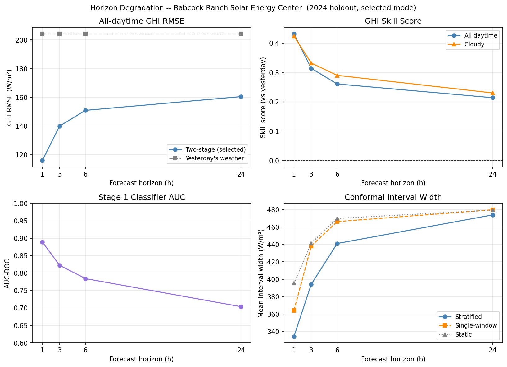
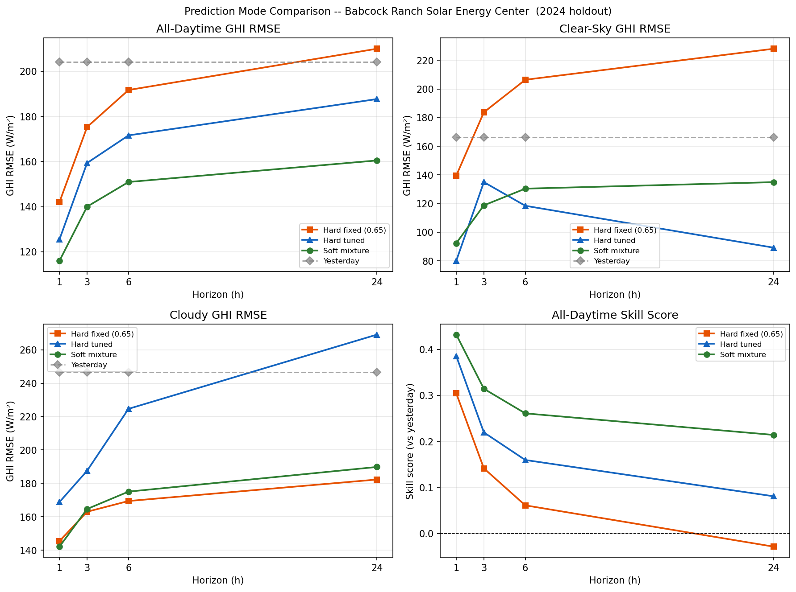
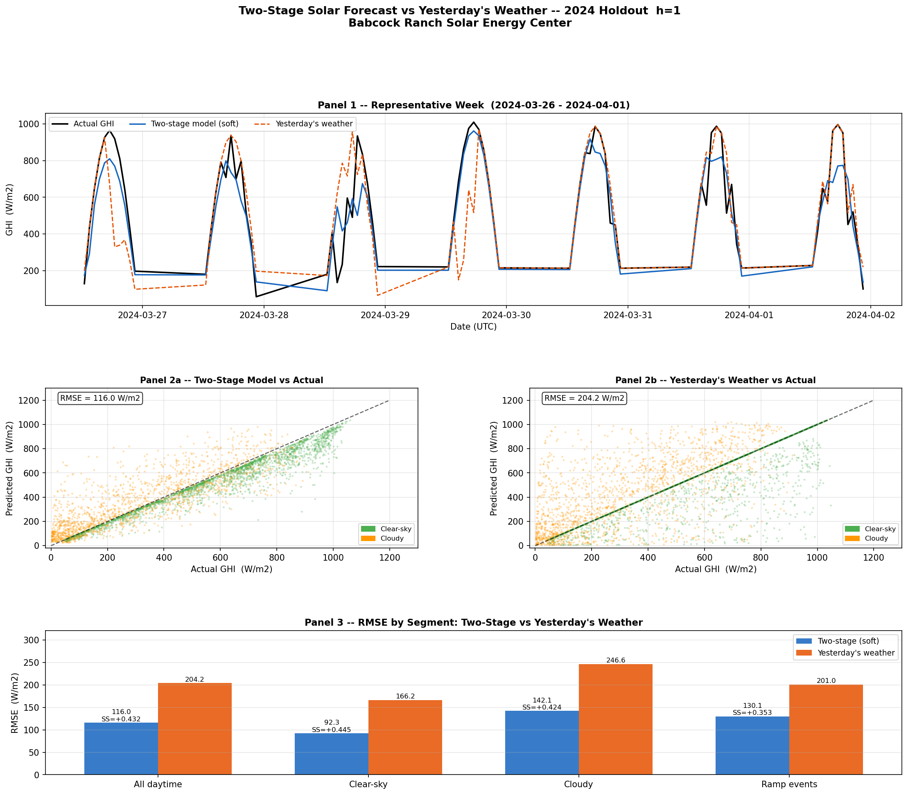
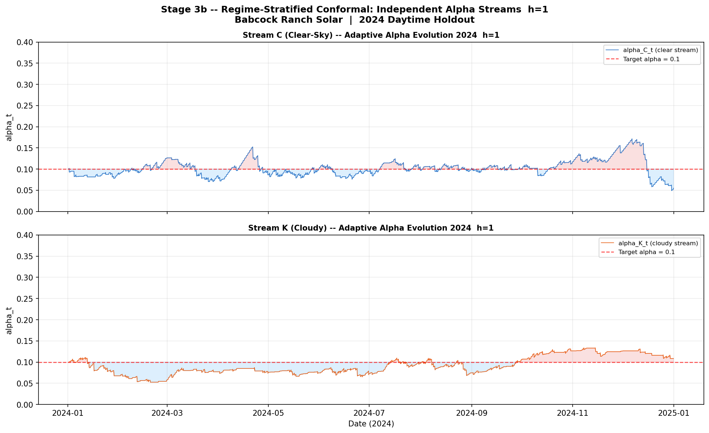
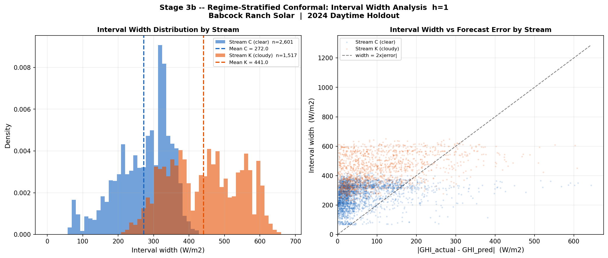

# Multi-Horizon Solar Irradiance Forecasting with LightGBM and Conformal Prediction

This project forecasts solar irradiance (1–24 hour horizons) for a real utility-scale solar site using a two-stage LightGBM model, then wraps each point forecast in a calibrated uncertainty interval via regime-stratified adaptive conformal prediction — giving both what the output will likely be and how confident that estimate is, which matters directly for dispatch, storage scheduling, and day-ahead planning decisions.

**Site:** Babcock Ranch Solar Energy Center — lat 26.78, lon −81.53 (Charlotte County, FL)  
**Data:** NSRDB GOES Conus PSM v4 · hourly · 2018–2024  
**Target:** Clearness index kt → GHI (W/m²)  
**Horizons:** h = 1, 3, 6, 24 hours  
**Model:** Two-stage LightGBM (classifier + kt regressor) with soft mixture prediction  
**Intervals:** Regime-stratified adaptive conformal prediction (90% target coverage)  
**Test year:** 2024 holdout

---

## Key Results

### Point Forecast — 2024 Holdout (Soft Mixture, Selected Mode)

| h | Mode | Threshold | GHI RMSE (W/m²) | Skill vs Yesterday | Clear RMSE | Cloudy RMSE | Stage 1 AUC |
|--:|:-----|----------:|----------------:|-------------------:|-----------:|------------:|------------:|
|  1 | soft | 0.35 (routing) | **116.0** | **+0.432** |  92.3 | 142.1 | 0.8895 |
|  3 | soft | 0.45 (routing) | **140.0** | **+0.314** | 118.7 | 164.7 | 0.8224 |
|  6 | soft | 0.35 (routing) | **150.9** | **+0.261** | 130.4 | 175.1 | 0.7843 |
| 24 | soft | 0.30 (routing) | **160.5** | **+0.214** | 134.9 | 189.8 | 0.7037 |

Yesterday's weather baseline: 204.2 W/m² all-daytime, 166.3 W/m² clear-sky, 246.6 W/m² cloudy.  
Skill = 1 − RMSE_model / RMSE_yesterday.

### Conformal Intervals — 2024 Holdout (Regime-Stratified Adaptive, α = 0.10)

| h | Coverage | Mean Width (W/m²) | Winkler Score | Single-Window Cov. | Static Cov. |
|--:|---------:|------------------:|--------------:|-------------------:|------------:|
|  1 | 0.898 | 334.3 | 497.7 | 0.898 | 0.920 |
|  3 | 0.899 | 394.1 | 555.1 | 0.898 | 0.896 |
|  6 | 0.899 | 441.0 | 599.9 | 0.898 | 0.894 |
| 24 | 0.899 | 473.8 | 651.1 | 0.898 | 0.890 |

Target coverage: 0.90. Stratified adaptive equals or improves Winkler score vs single-window and static at all horizons.

---

## Conformal Prediction

Point forecasts give a single estimate, but solar irradiance has strongly time-varying uncertainty because cloud cover, ramps, and clear-sky periods have very different error behavior. To quantify forecast uncertainty, this project uses conformal prediction to convert point forecasts into prediction intervals.

Given calibration observations $y_i$ and point forecasts $\hat{y}_i$, define the absolute residual or nonconformity score

$$
s_i = |y_i - \hat{y}_i|.
$$

For a target miscoverage level $\alpha$, such as $\alpha = 0.10$ for a 90% prediction interval, choose a conformal radius from the calibration scores:

$$
q_{1-\alpha} = Q_{1-\alpha}\left(\{s_i\}_{i=1}^{n}\right).
$$

Here, $Q_{1-\alpha}$ denotes the empirical $(1-\alpha)$-quantile of the calibration nonconformity scores.

The resulting prediction interval for a new forecast $\hat{y}_{t}$ is

$$
\left[\hat{y}_{t} - q_{1-\alpha},\ \hat{y}_{t} + q_{1-\alpha}\right].
$$

In this project, the target variable for the final interval is GHI, so $y_t = GHI_t$ and $\hat{y}_t = \widehat{GHI}_t$. The conformal calibration year is kept separate from the model training years, so interval widths are estimated from out-of-sample residuals rather than training errors.

The final pipeline also uses regime-stratified adaptive conformal intervals. Instead of using one residual distribution for all solar conditions, the method keeps separate residual streams for predicted clear and predicted cloudy regimes. This allows intervals to remain narrower during stable clear-sky periods while widening during cloudier, higher-uncertainty periods.

---

## Horizon Degradation



GHI RMSE and skill score vs the yesterday's weather baseline, plotted across h = 1, 3, 6, 24. Stage 1 AUC, and conformal interval width are included. Skill degrades from +0.43 at h=1 to +0.21 at h=24 as the model relies on older lag observations.

---

## Prediction Mode Comparison



Three prediction modes evaluated on the 2024 holdout for all horizons:

- **Hard fixed (threshold 0.65):** if p_clear ≥ 0.65, kt_pred = 1.0 else Stage 2 model. Fixed across all horizons.
- **Hard tuned:** same hard routing at a horizon-specific threshold selected to minimize validation-year (2022) GHI RMSE. Lower thresholds route more hours to kt_pred = 1.0, reducing clear-sky RMSE at the cost of higher cloudy RMSE.
- **Soft mixture (selected):** `kt_pred = p_clear × 1.0 + (1 − p_clear) × kt_cloudy`. Avoids the hard binary routing decision. Selected as the best-performing mode at all four horizons based on 2022 validation-year GHI RMSE.

The soft mixture produces the most balanced RMSE across clear-sky and cloudy segments and was selected as the deployed mode for both point prediction and conformal calibration.

---

## Representative Forecast — h = 1



Point forecast vs yesterday's weather baseline for the 2024 holdout, h = 1. Panels show a representative high-variability week, scatter plots by sky regime, and RMSE by segment.

---


## Motivation

Accurate short-horizon solar irradiance forecasts are operationally valuable for:

- **Intraday dispatch:** real-time balance between generation and load
- **Ramp management:** anticipating rapid GHI drops or recoveries
- **Battery storage scheduling:** optimal charge/discharge decisions
- **Day-ahead planning:** market bids, curtailment planning, and maintenance windows

This project addresses h = 1–6 (intraday) and h = 24 (day-ahead, history-only) horizons for a utility-scale solar site.

---

## Data and Target

**Source:** NSRDB GOES Conus PSM v4 (v4.0.1), provided by NREL  
**Site:** Babcock Ranch Solar Energy Center, Charlotte County, FL  
**Coordinates:** 26.78°N, −81.53°W (Location ID 2472451)  
**Resolution:** 1-hour intervals, UTC timestamps (midpoint at :30)  
**Years:** 2018–2024 (~61,300 total hourly rows)

**Target variable — clearness index:**

```
kt = GHI / clearsky_GHI
```

kt is defined for daytime hours where clearsky_GHI ≥ 50 W/m²; set to NaN otherwise.

**GHI recovery:**

```
GHI_pred = kt_pred × clearsky_GHI[t]
```

clearsky_GHI[t] is deterministic (NSRDB REST2 model, known at forecast issuance time). The model predicts kt; GHI is recovered by scaling. This separates the astronomical/optical component (clearsky_GHI) from the cloud-driven attenuation (kt).

**Clear-sky regime:** hours with `cloud_type ∈ {0, 1}` (NSRDB cloud retrieval: Clear, Probably Clear).

---

## Forecast Horizon Design

For a forecast issued at time t − h targeting time t, every model feature must be derived from observations available at or before t − h:

| Horizon | Interpretation | Feature availability |
|--------:|:--------------|:--------------------|
| h = 1 | Next-hour intraday | Observations through t − 1 |
| h = 3 | 3-hour intraday | Observations through t − 3 |
| h = 6 | 6-hour intraday | Observations through t − 6 |
| h = 24 | Same-hour next day (history only) | Observations through t − 24 |

All lag features are named `kt_lag_{s}` where s ≥ h. For h = 24, the shortest lag is `kt_lag_24` (yesterday same hour). Rolling statistics are computed over `kt.shift(h)` (i.e., the most recent observable value at forecast issuance) and further into the past.

---

## Leakage Controls

Several safeguards prevent target leakage:

**No current-time observation features.** The following are never used as model features:
- raw `kt[t]` or `GHI[t]`
- raw `cloud_type[t]` or `is_clear_sky[t]`
- unshifted `surface_albedo[t]`

**Horizon-safe lag features.** Every lagged input satisfies lag ≥ h. Feature names encode the actual lag: `kt_lag_1` at h=1 refers to t−1; `kt_lag_24` at h=24 refers to t−24.

**Horizon-safe rolling features.** Rolling kt statistics (3-, 6-, 24-hour windows) are computed over `kt.shift(h)` before rolling, not over raw kt. An initial development issue with current-inclusive rolling kt features was identified and corrected; the final results use horizon-safe rolling features throughout.

**Surface albedo.** Only lagged values are included (`surface_albedo_lag_h`, `surface_albedo_lag_24`, `surface_albedo_lag_48`).

**Temporal split separation.** The validation year (2022), conformal calibration year (2023), and holdout test year (2024) are never used during model training. Threshold and prediction-mode selection use only 2022.

**Automated leakage validation.** `src/validate_leakage.py --horizon {h}` verifies the saved feature lists and parquet columns against all of the above constraints, including a numerical rolling-feature check. All four horizons pass all checks.

---

## Model Architecture

The pipeline is a two-stage LightGBM model with three prediction modes:

### Stage 1 — Clear/Cloudy Classifier

LightGBM binary classifier predicting `p_clear = P(cloud_type ≤ 1 | features)`.  
Output is a continuous probability used for routing (hard modes) or blending (soft mode).

Features: horizon-lagged kt, lagged is_clear_sky, rolling kt statistics, lagged meteorological variables (temperature, wind speed, humidity), solar position features (hour_sin, hour_cos, doy_sin, doy_cos, sza_cos).

### Stage 2 — kt Regressor

LightGBM regressor trained on **cloudy hours only** (cloud_type > 1), predicting kt for hours when the classifier assigns low p_clear. Additional features beyond Stage 1: lagged surface albedo, kt−SZA interaction, GHI delta features.

### Prediction Modes

Three modes evaluated; best chosen per horizon by validation-year (2022) GHI RMSE:

**Hard fixed:** `if p_clear ≥ 0.65: kt_pred = 1.0  else: kt_pred = Stage2(X)`

**Hard tuned:** Same routing, threshold optimized per horizon on 2022 validation data.

**Soft mixture (selected for all horizons):**
```
kt_pred = p_clear × kt_clear + (1 − p_clear) × kt_cloudy
```
where `kt_clear = 1.0` (constant) and `kt_cloudy = clip(Stage2(X), 0, 1)`.

For stream routing in conformal intervals, the tuned threshold is applied to `p_clear` even in soft mode. This produces a `pred_clear` binary flag used only for interval stream assignment, not for the point prediction.

### Selected Modes and Thresholds

| h | Selected mode | Routing threshold | Val RMSE (2022) |
|--:|:-------------|------------------:|----------------:|
|  1 | soft | 0.35 | 127.9 W/m² |
|  3 | soft | 0.45 | 146.8 W/m² |
|  6 | soft | 0.35 | 155.6 W/m² |
| 24 | soft | 0.30 | 165.1 W/m² |

---

## Validation Design

Strict temporal separation with no data re-use across splits:

| Period | Role |
|:-------|:-----|
| 2018–2021 | Model training (Stage 1 classifier, Stage 2 regressor walk-forward CV + final fit) |
| 2022 | Validation: early stopping, Stage 1 threshold grid search, prediction mode selection |
| 2023 | Conformal calibration: nonconformity score warm-up window initialization only |
| 2024 | Final holdout test: all reported metrics |

Stage 2 uses walk-forward cross-validation with four folds (val years 2019, 2020, 2021, 2022) to select `n_estimators` before final training on 2018–2021.

---

## Baselines

| Baseline | Description |
|:---------|:------------|
| **Yesterday's weather** | `GHI_pred[t] = kt_lag_24[t] × clearsky_GHI[t]` — same-hour GHI from 24 h prior, rescaled by today's clear-sky |
| **Persistence (kt)** | Lag-h kt value × current clearsky_GHI; evaluated on cloudy holdout only |
| **Climatological mean kt** | Historical (month, hour) mean kt × current clearsky_GHI; evaluated on cloudy holdout only |
| **Static conformal** | Fixed quantile q from 2023 calibration scores; no adaptation |
| **Single-window adaptive conformal** | Shared rolling window across all regimes, adaptive α |
| **Naïve Gaussian intervals** | ±1.96σ from 2023 calibration residuals |

Skill score is computed against yesterday's weather on the 2024 daytime holdout.

---

## Conformal Prediction Intervals

Uncertainty intervals are produced using adaptive conformal prediction calibrated on 2023 nonconformity scores.

**Nonconformity score:** `nc[t] = |GHI_actual[t] − GHI_pred[t]|`

**Three methods compared:**

| Method | Description |
|:-------|:------------|
| Static conformal | Fixed q = quantile(nc_2023, 1 − α); no adaptation |
| Single-window adaptive (Stage 3) | Rolling window of 200 scores, adaptive α with γ = 0.005 |
| **Regime-stratified adaptive (Stage 3b)** | **Two independent streams: Stream C (predicted clear) and Stream K (predicted cloudy), each with their own rolling window and adaptive α** |

**Parameters:** α = 0.10 (90% target coverage), γ = 0.005, window size = 200.

**Calibration procedure:** 2023 predictions and actual GHI are generated using the same selected mode and threshold as the 2024 test. The 2023 nonconformity scores initialize the Stream C and Stream K rolling windows. No 2018–2022 training residuals are used in conformal calibration.

**Coverage and efficiency (2024 holdout):**

| h | Strat. Cov. | Strat. Width | Strat. Winkler | Single Winkler | Static Winkler |
|--:|------------:|-------------:|---------------:|---------------:|---------------:|
|  1 | 0.898 | 334.3 W/m² | 497.7 | 527.7 | 534.6 |
|  3 | 0.899 | 394.1 W/m² | 555.1 | 591.8 | 617.3 |
|  6 | 0.899 | 441.0 W/m² | 599.9 | 628.6 | 654.7 |
| 24 | 0.899 | 473.8 W/m² | 651.1 | 659.6 | 690.4 |

**Notes:**
- Marginal coverage is ≈ 0.90 at all horizons for all adaptive methods.
- Cloudy-regime coverage (true label) is below the 0.85 flag threshold at h=1, h=3, and h=24, partially due to misrouted hours in Stream C.
- Regime-stratified conformal reduces Winkler score vs single-window and static at every horizon.



Independent adaptive α evolution for Stream C and Stream K at h = 1. Each stream tracks its own coverage error and adjusts the effective quantile independently.



Interval width distributions and width-vs-error scatter for the two conformal streams at h = 1. Stream K (cloudy) carries wider intervals than Stream C (clear).

---

## Repository Structure

```
nextera_solar_forecast/
├── data/
│   ├── raw/
│   │   ├── nsrdb_babcock_2018_2024.parquet
│   │   └── nsrdb_babcock_site_metadata.json
│   └── processed/
│       ├── nsrdb_with_pvlib.parquet
│       ├── features.parquet
│       ├── features_h001.parquet
│       ├── features_h003.parquet
│       ├── features_h006.parquet
│       └── features_h024.parquet
├── models/
│   ├── h001/  stage1_classifier.pkl, stage2_regressor.pkl,
│   │          stage1_feature_list.json, stage2_feature_list.json,
│   │          stage1_threshold.json, prediction_mode_selection.json
│   ├── h003/  (same structure)
│   ├── h006/  (same structure)
│   └── h024/  (same structure)
├── outputs/
│   ├── h001/  stage1_calibration_report.txt, stage2_full_report.txt,
│   │          stage3_conformal_report.txt,
│   │          conformal_stratified_predictions_2024.parquet
│   ├── h003/  (same structure)
│   ├── h006/  (same structure)
│   ├── h024/  (same structure)
│   ├── horizon_comparison.csv
│   ├── horizon_comparison.txt
│   └── horizon_comparison.md
├── notebooks/
│   ├── horizon_degradation_curve.png
│   ├── prediction_mode_comparison.png
│   ├── h001/  model_vs_yesterday_h001.png,
│   │          conformal_conditional_coverage_h001.png,
│   │          conformal_stratified_alpha_h001.png,
│   │          conformal_stratified_widths_h001.png, ...
│   ├── h003/  (same structure)
│   ├── h006/  (same structure)
│   └── h024/  (same structure)
├── src/
│   ├── fetch_nsrdb.py            Download NSRDB data via API
│   ├── validate_data.py          Data quality checks
│   ├── clearsky.py               pvlib clear-sky augmentation
│   ├── features.py               Horizon-agnostic feature engineering
│   ├── horizon_utils.py          Shared horizon-parametric feature cols and prediction functions
│   ├── stage1_classifier.py      Stage 1 LightGBM classifier (cross-validation)
│   ├── stage1_finalize.py        Stage 1 final model training and calibration report
│   ├── stage2_regressor.py       Stage 2 kt regressor + threshold tuning + mode selection
│   ├── stage3_conformal.py       Single-window adaptive conformal (Stage 3)
│   ├── stage3b_stratified_conformal.py   Regime-stratified conformal (Stage 3b)
│   ├── horizon_comparison.py     Multi-horizon comparison tables and plots
│   └── validate_leakage.py       Automated leakage checks
├── requirements.txt
└── README.md
```

---

## Reproducing the Pipeline

**Dependencies:** Python 3.9+ via Anaconda (pandas 2.0, numpy 1.23, lightgbm, scikit-learn, joblib, pyarrow, matplotlib, pvlib).

Run all steps for a single horizon (example: h = 1):

```bash
# Step 1 — download NSRDB data (one-time, API key required)
python src/fetch_nsrdb.py

# Step 2 — data quality validation
python src/validate_data.py

# Step 3 — build horizon-parametric feature matrices
python src/features.py --horizon 1

# Step 4 — train Stage 1 classifier
python src/stage1_classifier.py --horizon 1
python src/stage1_finalize.py --horizon 1

# Step 5 — train Stage 2 regressor, tune threshold, select prediction mode
python src/stage2_regressor.py --horizon 1

# Step 6 — run regime-stratified conformal prediction
python src/stage3b_stratified_conformal.py --horizon 1

# Step 7 — validate leakage safeguards
python src/validate_leakage.py --horizon 1
```

Repeat `--horizon 3`, `--horizon 6`, `--horizon 24` for remaining horizons.

```bash
# Step 8 — generate multi-horizon comparison tables and plots
python src/horizon_comparison.py
```

Outputs:
- `outputs/h{HHH}/stage2_full_report.txt` — threshold tuning, mode comparison, segment metrics
- `outputs/h{HHH}/stage3_conformal_report.txt` — conformal coverage, widths, Winkler scores
- `outputs/horizon_comparison.csv` — all metrics in tabular form
- `notebooks/horizon_degradation_curve.png`
- `notebooks/prediction_mode_comparison.png`

---

## Limitations

- **No NWP data.** All features are derived from lagged NSRDB observations. The h = 24 forecast relies on yesterday's same-hour observations only and does not incorporate any numerical weather prediction. A production-grade day-ahead forecast would use HRRR or GFS output.
- **h = 24 skill is modest.** At h = 24, GHI RMSE = 160.5 W/m² and skill score = +0.21 vs yesterday's weather. Clear-sky hours are predicted well; cloudy and ramp hours remain difficult without NWP.
- **Cloudy conformal coverage below 0.85 target.** At h = 1, 3, and 24, true cloudy hours fall below the 0.85 coverage flag, partly due to misrouted hours being served by the narrower clear-stream quantile.
- **Single-site model.** No spatial NSRDB neighbors or upstream weather station data are used.
- **GHI only.** The model predicts GHI; conversion to AC power output requires a separate PV system model (pvlib).
- **Conditional coverage varies by cloud type and time of day.** Opaque ice, overshooting, and late-afternoon hours show coverage below 0.85 at h = 24 (documented in conformal reports).

---

## Future Work

- Add HRRR/GFS forecast variables (wind, temperature, cloud fraction) as features for h = 6 and h = 24
- Incorporate nearby spatial NSRDB grid points as additional predictors
- Convert GHI forecasts to AC power using pvlib PVSystem model
- Benchmark a single-stage LightGBM quantile regression model against the two-stage approach
- Improve conformal stratification for misrouted and ramp hours (third stream or online re-routing)
- Extend to sub-hourly resolution using NSRDB 5-minute PSM product

---

## Data Source

**NSRDB GOES Conus PSM v4.0.1**  
Provider: National Renewable Energy Laboratory (NREL)  
API: `https://developer.nrel.gov/api/nsrdb/v2/solar/nsrdb-GOES-conus-v4-0-0-download.csv`  
Resolution: 1-hour (UTC, timestamp at :30 past the hour)  
Grid snap: requested 26.7736/−81.5242 → snapped to 26.78/−81.53 (Location ID 2472451)  
Years retrieved: 2018, 2019, 2020, 2021, 2022, 2023, 2024
